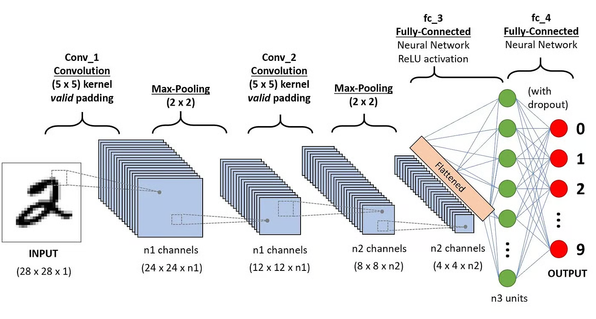

# CNN - Convolutional Neural Network

- using CNN on Fashion MNIST Dataset

- CNN uses convolution and pooling layer to reduce the dimensions and training ANN over it.

- provides the best result on computer vision tasks

#### Architecture

Blog:
https://www.datacamp.com/tutorial/introduction-to-convolutional-neural-networks-cnns

