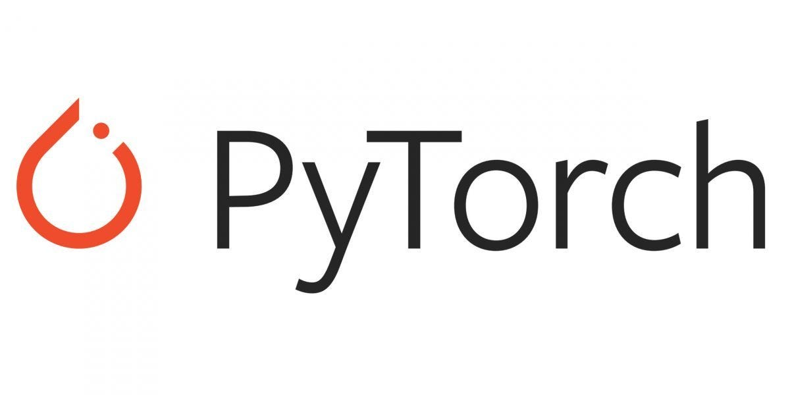

# Introduction to PyTorch

Open Source Python Library for Deep Learning ( Developed by Meta AI)

### Timeline:

**2002** - Torch  
- provided tensor based operations on GPU. It was popular among scientis and researchers
- Initially Luwa based

**2017** - PyTorch  
- Implemented *torch* library in Python
- As Python was popular among Machine Learning Researchers

### Key Features

1. Tensor Computation:
    - Does the tensor computation in very optimized way
    - Tensors (Multi-Dimensional Vectors)

2. Python compatibality:
    - Integration with popular python libraries (numpy, pandas, etc.)

3. Dynamic Computation Graph:
    - useful for visualization of computations, easier debugging
    - New feature implemented in pytorch. In Torch - Static Graphs were Implemented

4. Automatic Differentiation:
    - Optimized Gradient Calculation.
    - AutoGrad - Automatic Differentiation.

### PyTorch Domain Libraries:

1. torchvision - Tools, datasers, model architectures, and image transfomration for computer vision Tasks
2. torchtext - Tools and datasets for Natural Langauge Processing (NLP)
3. torchaudio - audio tasks
4. torcharrow - accelerated data loading and preprocessinng for tabular and time series data.
5. torchserve - makes it easy to deply and scale in production enviourments
6. pytorch-lightning - High Level API

**Major Companies using PyTorch**

- Meta (Facebook, Instagram, Meta AI research)   
- Microsoft(Azure ML, Bing Search)  
- Tesla (Autopiliot System)  
- OpenAI (GPT, DALL-E)
